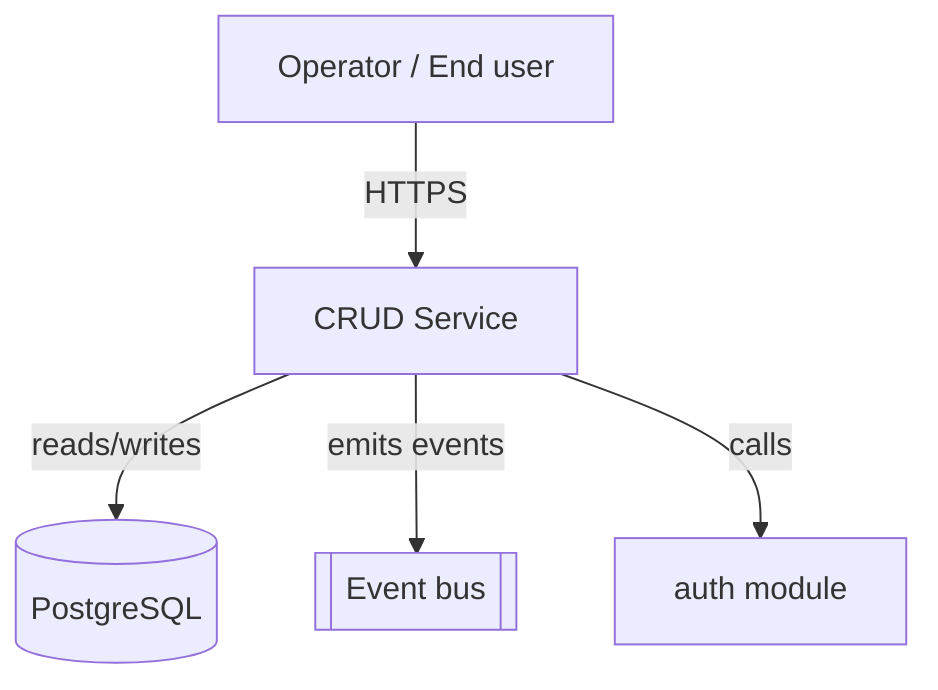
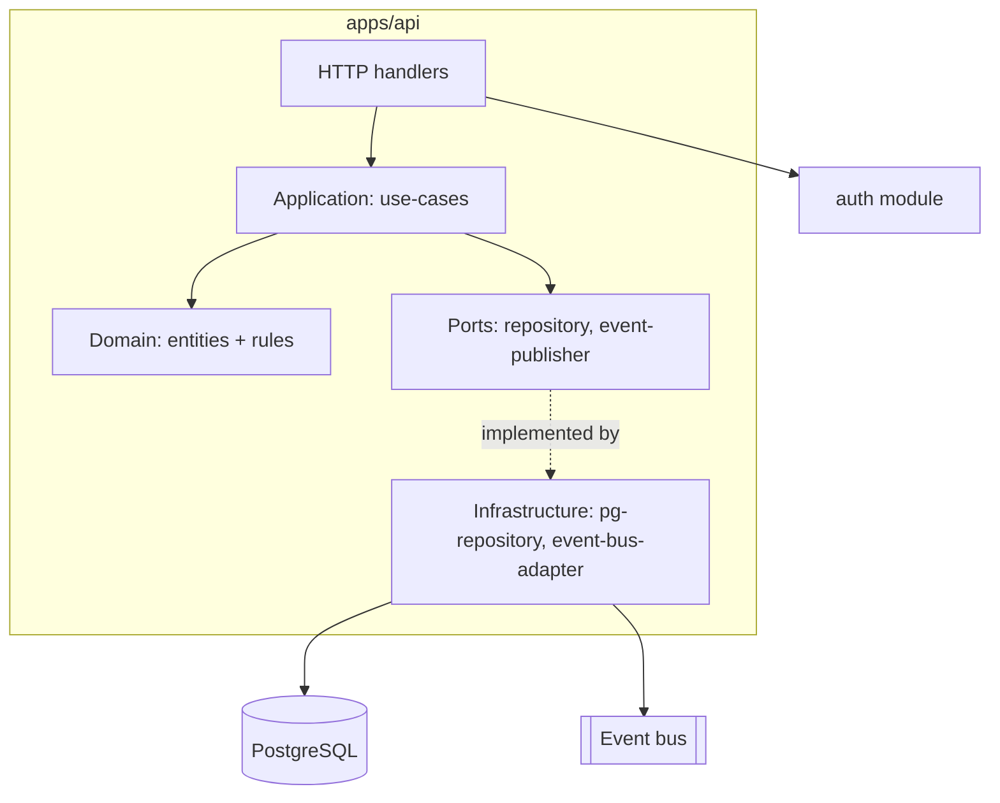

# Blueprint: CRUD Service

**Use when** the product is primarily create/read/update/delete over a data model — most
backend/API products (ops platforms, admin tools, marketplaces).

## Context (C4 level 1)

## Containers (C4 level 2)

## Layering & dependency rules
- `domain/` — entities, invariants, pure validation. No imports outside `domain/`.
- `application/` — use-cases; depends on `domain` + declares `ports` (interfaces); no direct
  DB/HTTP.
- `infrastructure/` — implements ports; the only layer allowed to import a DB/HTTP client.
- `handlers/` (the app, not a module) — thin: parse/validate input, call one use-case, map the
  result to a response. No business logic in handlers.

## Module shape
One module per bounded capability (e.g., `orders`, `inventory`), each with its own contract.
Cross-capability calls go through the other module's contract, never its repository directly.

## Anti-patterns this blueprint forbids
- A handler calling the database directly (skips `application`/`domain`).
- Two modules sharing a database table without a contract between them.
- Business rules living in the HTTP layer or in a Postgres trigger.
