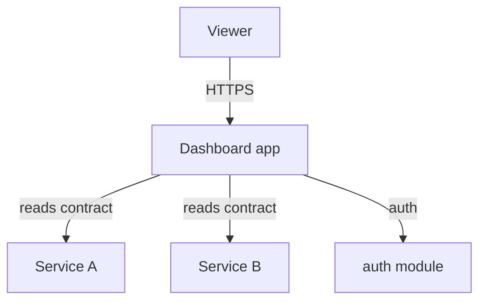
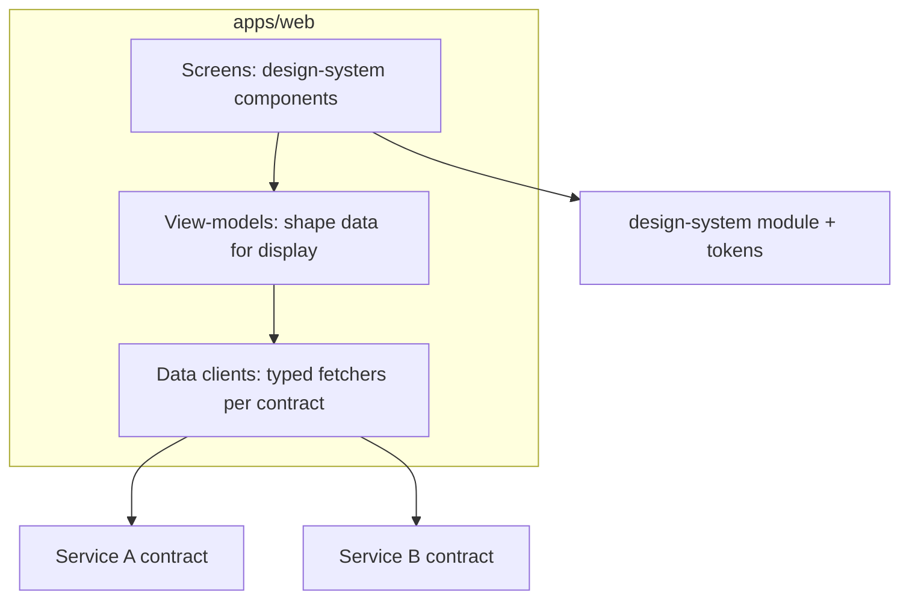

# Blueprint: Dashboard

**Use when** the primary interface is data visualization/monitoring over existing services —
metrics dashboards, admin overviews, ops consoles.

## Context (C4 level 1)

## Containers (C4 level 2)

## Layering & dependency rules
- `screens/` — composition + layout only, built from `design-system`; no data-fetching logic.
- `view-models/` — pure functions that shape raw contract responses into what a screen renders
  (aggregation, formatting, empty/loading/error mapping). No I/O.
- `data-clients/` — the only layer that calls out (via typed contract clients); no UI concerns.
- Every screen handles loading/empty/error/success explicitly (WCAG + `gate-design`).

## Module shape
Dashboards are thin by design: reuse `data-table`, `dashboard-kit`, `design-system` before
building any new chart/table primitive. A new visualization primitive is a harvest candidate,
not a one-off.

## Anti-patterns this blueprint forbids
- A screen component calling `fetch`/an SDK directly (bypasses `data-clients`, breaks
  testability).
- Business aggregation logic duplicated per-screen instead of living once in a view-model.
- Hard-coded thresholds/colors instead of design tokens.
