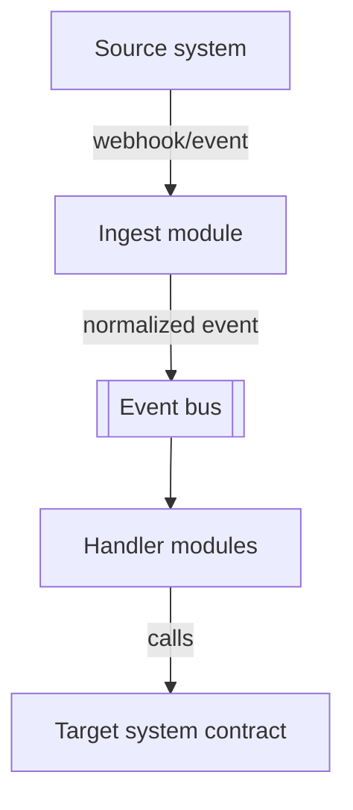
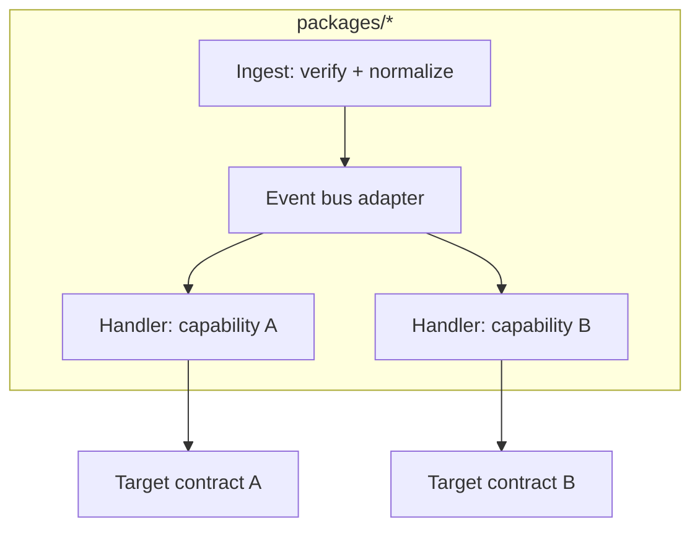

# Blueprint: Event Integration

**Use when** the work connects systems via events/webhooks rather than serving a UI —
integrations, automations, cross-system sync.

## Context (C4 level 1)

## Containers (C4 level 2)

## Layering & dependency rules
- **Ingest is dumb on purpose:** verify signature/auth, normalize the payload to an internal
  event shape, publish. No business logic in ingest.
- **Handlers are independent consumers:** one handler = one capability; a handler failing never
  blocks another handler on the same event (fan-out, not a pipeline of handlers calling each
  other).
- **Idempotency is mandatory:** every handler must be safe to receive the same event twice
  (dedupe key in the contract).
- **Dead-letter, never drop:** a handler that can't process an event routes it to a dead-letter
  path with the reason, and that's visible (structured log + alert), not silent.

## Module shape
One contract per event type (schema + version); handlers depend on the event contract, never on
the source system's raw payload shape directly.

## Anti-patterns this blueprint forbids
- A handler calling another handler directly instead of going through the bus.
- Processing an event without a dedupe/idempotency check.
- Swallowing a failed event instead of dead-lettering it.
