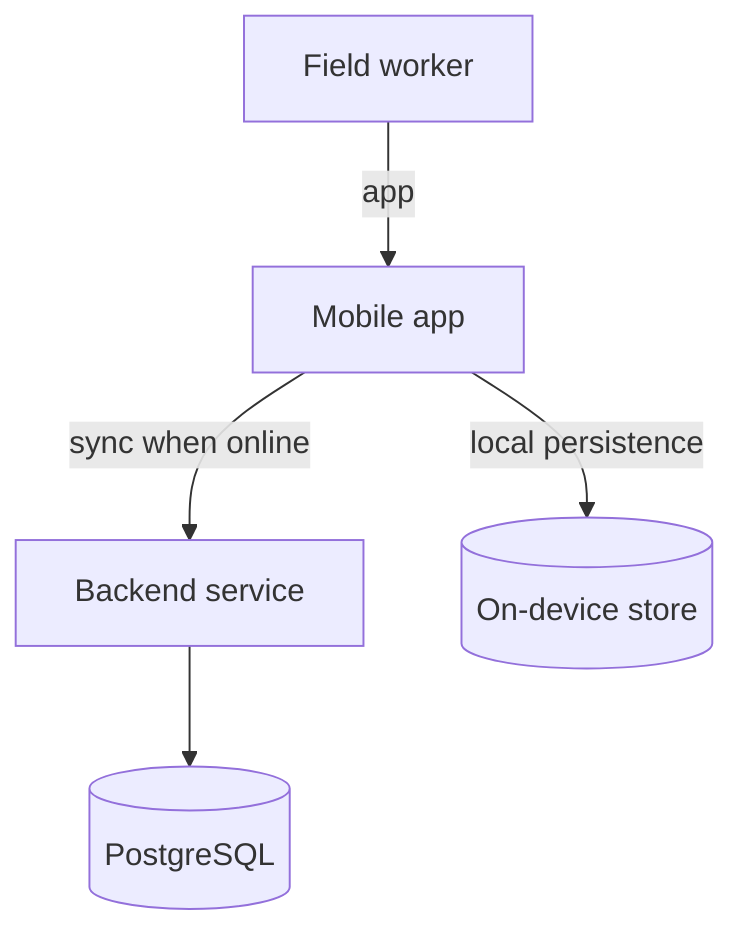
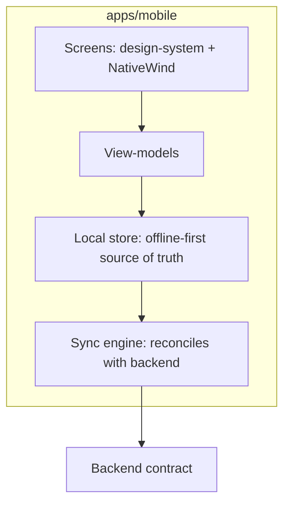

# Blueprint: Mobile Field App

**Use when** the primary interface is a mobile app used by field/offline workers (drivers,
technicians, inspectors) — connectivity is unreliable by default, not an edge case.

## Context (C4 level 1)

## Containers (C4 level 2)

## Layering & dependency rules
- **Local-first:** screens read/write the local store; the sync engine is the only layer that
  talks to the network. A screen must render correctly with zero connectivity.
- `sync-engine/` — owns conflict resolution (documented strategy: last-write-wins /
  operational-transform / manual — pick one per data type and record it in the contract).
- No business rule differs between online and offline mode — only *when* it's persisted differs.

## Module shape
Reuse `offline-sync` + `design-system` (native bindings) before building bespoke sync logic —
conflict resolution is exactly the kind of thing that should be a Registry module, not
reinvented per product.

## Anti-patterns this blueprint forbids
- A screen blocking on a network call with no offline fallback.
- Silent data loss on sync conflict (must surface to the user or resolve per a documented
  policy).
- Different validation rules online vs. offline.
